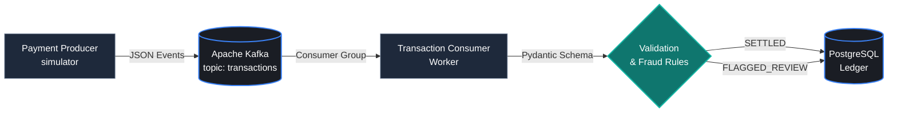

# Real-Time Financial Transaction Pipeline

[](https://www.python.org/)
[](https://kafka.apache.org/)
[](https://www.postgresql.org/)
[](https://www.docker.com/)
[](https://docs.pytest.org/)

An event-driven transaction ingestion microservice simulating real-time payment processing. Built with Python 3, Apache Kafka, and PostgreSQL, following Test-Driven Development (TDD) best practices.


---

## Architecture Flow



---

## Core Technical Features

* **Event Streaming:** Decoupled producer/consumer architecture utilizing Apache Kafka message brokering with persistent offsets.
* **Idempotent Storage:** Composite unique constraints (`transaction_id`) with `ON CONFLICT DO NOTHING` to guarantee exactly-once persistence semantics.
* **Strict Validation:** Pydantic models enforcing ISO-4217 currencies, non-negative amounts, and routing high-risk records ($> \$10,000$) to `FLAGGED_REVIEW`.
* **Testing:** 100% test coverage using **Pytest** covering schema serialization, risk thresholds, and database ingestion edge cases.

---

## Getting Started

### 1. Clone & Set Up Virtual Environment

```bash
git clone https://github.com/A-Khairy/fintech-transaction-pipeline.git
cd fintech-transaction-pipeline
python -m venv venv
```

Activate the virtual environment:

* **Windows (PowerShell):**
  ```powershell
  .\venv\Scripts\Activate.ps1
  ```
* **macOS / Linux:**
  ```bash
  source venv/bin/activate
  ```

Install dependencies:
```bash
pip install -r requirements.txt
```

---

### 2. Launch Infrastructure

Spin up Kafka, Zookeeper, and PostgreSQL in detached mode:
```bash
docker compose up -d
```

Verify the containers are healthy:
```bash
docker compose ps
```

---

### 3. Run Test Suite (TDD)

Execute the test suite validating payload models and risk logic:
```bash
pytest tests/ -v
```

---

### 4. Run the Pipeline

Open two terminal windows (with `venv` activated in both):

**Terminal 1 — Consumer Worker:**
```bash
python -m src.consumer
```

**Terminal 2 — Mock Payment Producer:**
```bash
python -m src.producer
```

---

### 5. Inspect Persisted Ledger Data

Query the PostgreSQL database directly:
```bash
docker compose exec postgres psql -U postgres -d transactions_db -c "SELECT transaction_id, amount, currency, status FROM transactions LIMIT 10;"
```

---

### Teardown

To shut down containers and networks without losing database volume data:
```bash
docker compose down
```